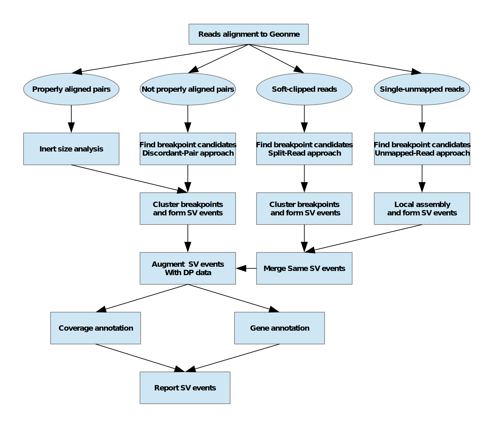

#### What is sver?
    sver is a software aimed at discovering structural variants from DNA alignment result.
#### How to install sver?
    1). clone repo
       git clone https://github.com/vanNul/sver  
    2). compile 
       cd sver    
       ./autogen.sh   
       ./configure --prefix=/path/to/install/dir/ 
       make & make install 
    3). test command 
       /path/to/install/dir/sver -b testdata/test.bam -g /Users/wood/Database/hg19/hg19.fa -a testdata/refGene.Anno.sorted.gz -r testdata/valid.bed -o testdata/sv.bcf -t testdata/sv.tsv
  
#### What kind of structural variants sver can discover?
    In principle, sver supports discovery of 5 classes of structural variants: inversion, deletion, duplication, insertion, translocation.  
    In practice, as long as a structural variant event has at least 2 split reads supporting or 2 discordant paired-end reads supports, sver will discover it. However, due to sequencing error and mapping ambiguity in some region of genome, some structural variant might not be discovered cofidently or even missed. 
    
#### What is the size limitations of structural variants sver can discover? 
|structural variant type| size limitations sver can discover
|-----------------------|--------------------------------------
|inversion              | > 100(default)
|deletion               | > 300(default)
|duplication            | > 100(default)
|insertion              | < insert size(depends on alignment)
|translocation          | no limit

#### How is sver implemented?  
    sver is implemented totally in C++, it does not need any third part scripts or software to assist its discovery of structural events. 
    After compilation, it is a standalone binary executable program and can work on its own. During compilation, it only depends on the excellent gorgeous htslib. 
    sver supports macos and linux palatform at the moment.  

#### What kind of sample can be fed to sver?  
     From whole genome to little panel, whether it is paired end library or single ended library, sver can handle all of them as long as they have FASTQ of massive parallel sequencing reads. At the moment it does not support RNA samples. 
      
#### What result formats does sver support?  
    sver can output bcf and tsv format results at the moment, all the records in bcf or tsv are sorted by chromosome and breakpoint coordinates naturally.  
    In the long run, I hope it will support vivid HTML format output with sequence and positions embedded.
    
#### Is sver fast? How much resources will it exhaust in one run?  
|benchmark| measure
|---------|-----------
|bam info | [0.5G, 5G]
|memory   | 2.5G(peak)
|cpu      | 8 threads
|time     | [6min, 30min]
    
#### How does sver work in real samples?  
|test samples       | recalling status
|-------------------|---------------------
|20 standard samples| 100% recalled
|6 real sample      | all except one
###### ps. fusionmap missed all the structural variants in the 6 real samples, the missing event has not any supporting alignment records somehow

#### Are there are too many negative positive events discovered by sver?  
    I haven't got many pure test samples which have all the structural events predefined exactly. But I think some negative positive events can be filtered under some principles  

#### How to run sver?
|steps|operation  |recommand tools
|-----|-----------|----------------------------------------------
|1    | QC        |[fqtool](https://github.com/vanNul/fqtool)
|2    | align     |[bwa](https://github.com/lh3/bwa)
|3    | sort      |[samtools](https://github.com/samtools/samtools)
|4    | markdup   |[duplexer](https://github.com/vanNul/duplexer)
|5    | sort/index|[samtools](https://github.com/samtools/samtools)
|6    | compute SV|[sver](https://github.com/vanNul/sver)
###### ps. all the software depends on API of htslib1.9, you'd better use htslib1.9 based softwares 

#### What reference genome version does sver use?  
    Both hg19 and hg38 will work as long as the annotation database file is the same version.  

#### How to prepare annotation database file?  
|steps|operation          |recommand tools
|-----|-------------------|---------------------------------------------------
|1    |get regene tsv file| [UCSC website](https://genome.ucsc.edu/index.html)
|2    |extract information| [getFeatureTsv](https://github.com/vanNul/util/blob/master/getFeatureTsv.cpp)
|3    |sort and index     | [tabix](https://github.com/samtools/htslib)

#### How does sver work?  

#### To do list
- [ ] process some complicated structural variant events such as complicated insertion.
- [ ] use local assembly to assist discover of more complicated structural variants.
- [x] calculate the allele counts more precisely, especially for duplication events.
- [x] merge same structural events explained by different data.
- [x] rescue split read for each breakpoint.
- [ ] rescue discordant paired ends read for each breakpoint.
- [ ] remove false positive insertion sequence coming from alignment without supplementary records.
- [ ] use consensus probe sequence to capture possible supporting reads of structural variants.
- [ ] use single unmapped reads to capture more structural variants.
- [ ] add filter module.
