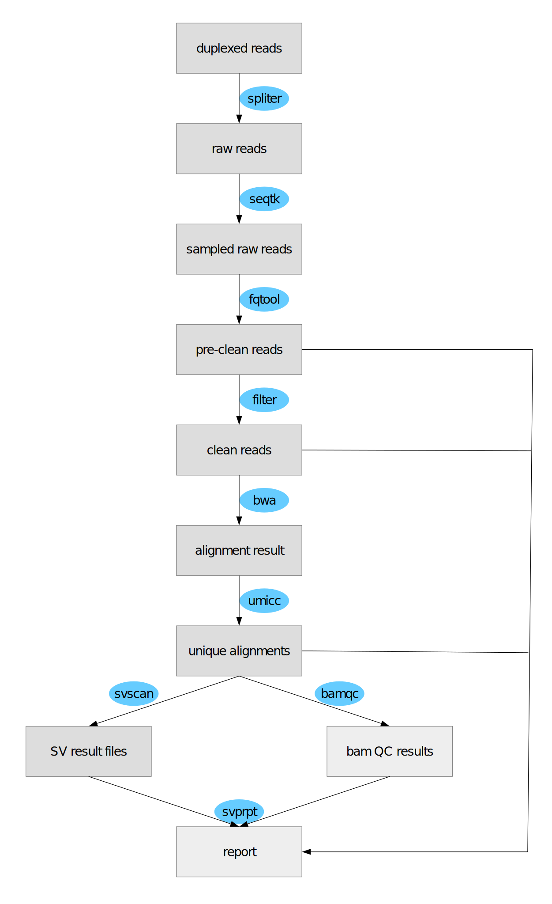
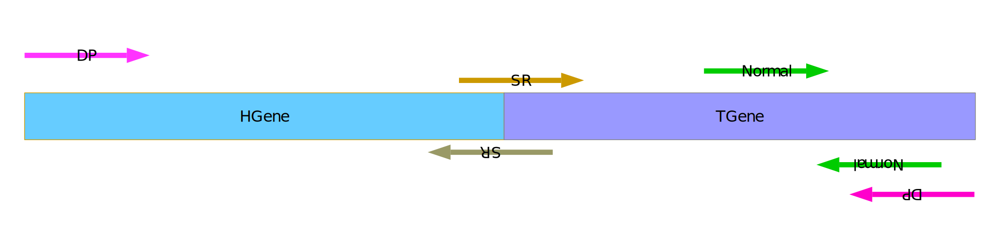
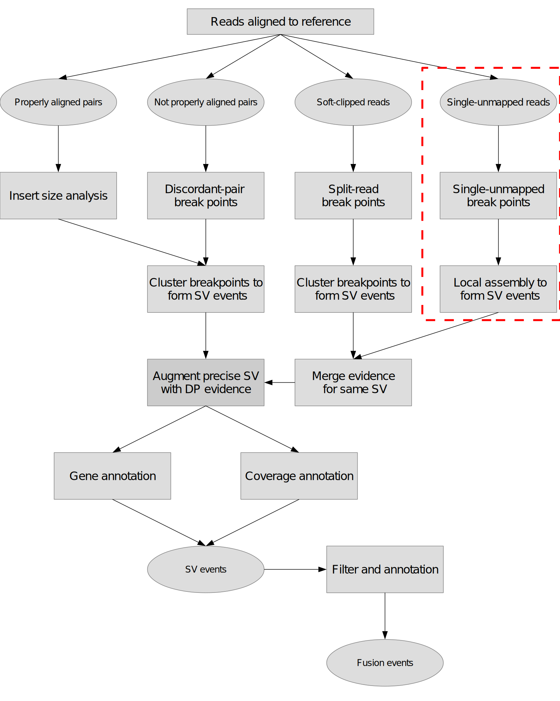

#### What is svscan?
    svscan is a software aimed at discovering structural variants from DNA/RNA alignment result. DNA should be aligned to genome, RNA should be aligned to transcriptome, the aligner is bwa.
#### How to install svscan?
    1). clone repo
       git clone https://github.com/vanNul/svscan  
    2). compile 
       cd svscan    
       ./autogen.sh   
       ./configure --prefix=/path/to/install/dir/ 
       make & make install 
  
#### What kind of structural variants svscan can discover?
    In principle, svscan supports discovery of 5 classes of structural variants: inversion, deletion, duplication, insertion, translocation.  
    In practice, as long as a structural variant event has at least 3 split reads supporting or 3 discordant paired-end reads supports, svscan will discover it. However, due to sequencing error and mapping ambiguity in some region of genome, some structural variant might not be discovered cofidently or even missed. 
    
#### What is the size limitations of structural variants svscan can discover? 
|structural variant type| size limitations svscan can discover
|-----------------------|--------------------------------------
|inversion              | > 100(default)
|deletion               | > 300(default)
|duplication            | > 100(default)
|insertion              | < insert size(depends on alignment)
|translocation          | no limit

#### How is svscan implemented?  
    svscan is implemented totally in C++, it does not need any third part scripts or software to assist its discovery of structural events. 
    After compilation, it is a standalone binary executable program and can work on its own. During compilation, it only depends on the excellent gorgeous [htslib](https://github.com/samtools/htslib).
    svscan supports macos and linux palatform at the moment.  

#### What kind of sample can be fed to svscan?  
     From whole genome to little panel, from DNA to RNA, whether it is paired end library or single ended library, svscan can handle all of them as long as they have FASTQ of massive parallel sequencing reads.
      
#### What result formats does svscan support?  
    svscan can output bcf and tsv format results at the moment, all the records in bcf or tsv are sorted by chromosome and breakpoint coordinates naturally.  
    In the long run, I hope it will support vivid HTML format output with sequence and positions embedded.
    
#### Is svscan fast? How much resources will it exhaust in one run?  
    in the extremely case, it can finish sv scanning of a bam about 1G in less than 1 minutes(memory 1G, thead 8); it can finish sv scanning of a 30x whole genome bam(about 70G) in less than 1hour(memory 10G, thread 20);
    
#### How does svscan work in real samples?  
|test samples       | recalling status
|-------------------|---------------------
|20 standard samples| 100% recalled
|6 real sample      | all except one
###### ps. fusionmap missed all the structural variants in the 6 real samples, the missing event has not any supporting alignment records somehow

#### Are there are too many negative positive events discovered by svscan?  
    I haven't got many pure test samples which have all the structural events predefined exactly. But I think some negative positive events can be filtered under some principles  

#### How to run svscan?  

#### What reference genome version does svscan use?  
    Both hg19 and hg38 will work as long as the annotation database file is the same version.  

#### How to prepare annotation database file?  
    check `svtools` for help

#### What evidence svscan makes use of?   

#### How does svscan work?  

#### To do list
- [x] calculate the allele counts more precisely, especially for duplication events.
- [x] merge same structural events explained by different data.
- [x] rescue split reads for each breakpoint without inertion sequence afterwards.
- [x] rescue split reads on breakpoint with short insertion sequence aftwards.
- [x] rescue discordant paired ends read for each cross-chrosome breakpoint.
- [x] remove false positive insertion sequence coming from alignment without supplementary records.
- [x] use consensus probe sequence to capture possible supporting reads of structural variants.
- [x] annotate fusion gene if both breakpoint spanning a gene.
- [x] add fusion filter and report program.
- [x] add filter module to filter out known structural variants or keep some import structural variants.
- [ ] rna false positive DEL from alternative splice should be filtered.
- [ ] process some complicated structural variant events such as complicated insertion.
- [ ] differenctiate ITX(intra chromosome translocation) and DUP(duplication) events.
- [ ] use local assembly to assist discover of more complicated structural variants.
- [ ] use single unmapped reads to capture more structural variants.
- [x] develop a GUI tool for result recheck.

#### svscan makes use of some ideas from other various excellent structural variant calling softwares as below
|Software    | Reference
|------------|----------
|delly       | [git](https://github.com/dellytools/delly), [paper](https://doi.org/10.1093/bioinformatics/bts378)
|svaba       | [git](https://github.com/walaj/svaba), [paper](https://genome.cshlp.org/content/early/2018/03/13/gr.221028.117)