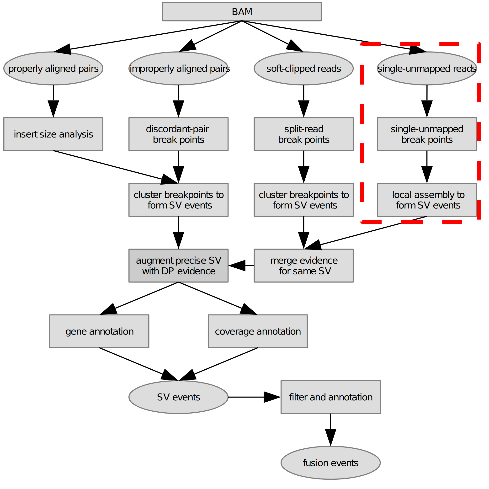

#### What is svscan?
    svscan is a software aimed at discovering structural variants from DNA/RNA alignment result. DNA should be aligned to genome, RNA should be aligned to customized transcriptome, the aligner is bwa.
#### How to install svscan?
    compile environment: gcc v4.7 or later version, autoconf v2.69 or later version
    dependence: htslib v1.10.2, libbwa v0.7.17-r1188, libxlsxwriter v0.9.4, zlib v1.2.11
    1). clone repo
       git clone https://github.com/vanNul/svscan  
    2). compile 
       cd svscan    
       ./autogen.sh   
       ./configure --prefix=/path/to/install/dir/ 
       make & make install 
  
#### What kind of structural variants svscan can discover?
    In principle, svscan supports discovery of 5 classes of structural variants: inversion, deletion, duplication, insertion, translocation.  
    By adjust the default parameters of svscan, a broad range of sensitivity/specifity can be reached.
      
#### What result formats does svscan support?  
    svscan can output bcf and tsv format results at the moment, all the records in bcf or tsv are sorted by chromosome and breakpoint coordinates naturally.  
    
#### Is svscan fast? How much resources will it exhaust in one run?  
    in the extremely case, it can finish sv scanning of a bam about 1G in less than 1 minutes(memory 1G, thead 8); it can finish sv scanning of a 30x whole genome bam(about 70G) in less than 1hour(memory 10G, thread 20)

#### What reference genome version does svscan use?  
    Both hg19 and hg38 will work as long as the annotation database file is the same version.  

#### How to prepare annotation database file?  
    check the companion `svtools` compiled alongside svscan for help

#### How does svscan work?  

#### To do list
- [x] calculate the allele counts more precisely, especially for duplication events.
- [x] merge same structural events explained by different data.
- [x] rescue split reads for each breakpoint without inertion sequence afterwards.
- [x] rescue split reads on breakpoint with short insertion sequence aftwards.
- [x] rescue discordant paired ends read for each cross-chrosome breakpoint.
- [x] remove false positive insertion sequence coming from alignment without supplementary records.
- [x] use consensus probe sequence to capture possible supporting reads of structural variants.
- [x] annotate fusion gene if both breakpoint spanning a gene.
- [x] add fusion filter and report program.
- [x] add filter module to filter out known structural variants or keep some import structural variants.
- [ ] rna false positive DEL from alternative splice should be filtered.
- [ ] process some complicated structural variant events such as complicated insertion.
- [ ] differenctiate ITX(intra chromosome translocation) and DUP(duplication) events.
- [ ] use local assembly to assist discover of more complicated structural variants.
- [ ] use single unmapped reads to capture more structural variants.
- [x] develop a GUI tool for result recheck.

#### svscan makes use of some ideas from other various excellent structural variant calling softwares as below
|Software    | Reference
|------------|----------
|delly       | [src](https://github.com/dellytools/delly), [paper](https://doi.org/10.1093/bioinformatics/bts378)
|svaba       | [src](https://github.com/walaj/svaba), [paper](https://genome.cshlp.org/content/early/2018/03/13/gr.221028.117)